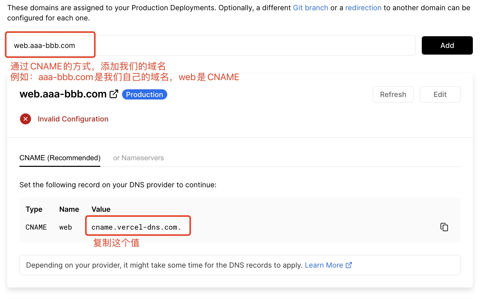
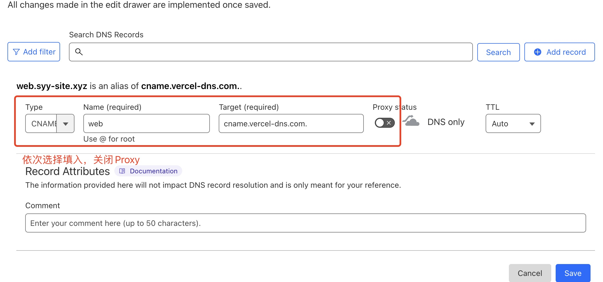
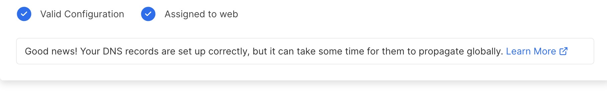

# 搭建了一个自己的 chatGpt 网站

## vercel

[vercel](https://vercel.com/)

### 登陆

    登陆vercel,关联自己的git账户（可以选择获取所有项目或指定项目）

### 部署项目

    选择 Add New (Project)
    会展示登陆时关联的项目列表，点击要部署项目后的import
    配置名称、选择框架、添加环境变量，

### 自定义域名

    部署时，vercel 会给你分配一个免费的域名，但是需要通过科学上网工具才能访问
    在项目中, 选择visit domain,添加自定义域名,是通过二级域名的方式来添加

## 申请域名

    免费的域名申请:

[地址](http://eu.org/)

    但是好像审核会很慢

    其他

[GoDaddy](https://dcc.godaddy.com/)

    一般收费的，冷门一点域名便宜，但是第二年续费很贵

## 网站托管

    将我们的域名托管到cloudflare

[cloudflare](https://dash.cloudflare.com/)
1、Add Site , 按照提示的步骤，完成一些配置
2、按照提示，修改原域名的 nameServer（会耗费一点时间）
3、然后在对应域名的 DNS 配置中,添加我们的域名配置

4、配置成功后，vercel 那边成功显示

## 访问我们的二级域名
